<p align="center">
  
</p>

<p align="center">
  
  
</p>


## `01` What I do

<table>
<tr>
<td width="50%" valign="top">

### 📱 Apps

Multi-year app developer. Native macOS and iOS in Swift and SwiftUI, Android in Kotlin, web front ends in TypeScript and React. End to end: UI, backend, release.

</td>
<td width="50%" valign="top">

### 🧠 Neural networks

I design, build and train my own neural networks: choosing the architecture, writing the training loop, tuning until the loss curve behaves. Python and PyTorch.

</td>
</tr>
<tr>
<td width="50%" valign="top">

### ⚙️ Platforms and DevOps

Multi-tenant platforms in C# and .NET with React front ends: OIDC single sign-on, versioned SQL migrations, structured logging. Containerised and shipped to Kubernetes through CI pipelines and GitOps with Argo CD.

</td>
<td width="50%" valign="top">

### 🤖 AI agents

Tooling on top of LLMs: MCP servers that let agents work with real business systems, Agent SDK bots, and a 3D stage that shows AI agents building a project live.

</td>
</tr>
</table>

## `02` Commit to cluster

Every merge builds, tests and packages a container. Argo CD syncs the desired state from git, and Kubernetes rolls it out.

<p align="center">
  
</p>

## `03` Stack

<p align="center">
  <sub><b>apps</b></sub><br>
  
</p>
<p align="center">
  <sub><b>backend and platform</b></sub><br>
  <br>
  <sub>plus Argo CD · Traefik · Keycloak / OIDC · SQL Server · Loki</sub>
</p>
<p align="center">
  <sub><b>ai and ml</b></sub><br>
  
</p>

## `04` Featured builds

<p align="center">
  <a href="https://github.com/r33hAB/claude-agent-visualizer"></a>
  <a href="https://github.com/r33hAB/MacUninstaller"></a>
  <a href="https://github.com/r33hAB/SteamIdler"></a>
  <a href="https://github.com/r33hAB/discord-follow-counter"></a>
</p>

## `05` Telemetry

<p align="center">
  
  
</p>

<p align="center">
  <picture>
    <source media="(prefers-color-scheme: dark)" srcset="https://raw.githubusercontent.com/r33hAB/r33hAB/output/snake-dark.svg">
    <source media="(prefers-color-scheme: light)" srcset="https://raw.githubusercontent.com/r33hAB/r33hAB/output/snake-light.svg">
    
  </picture>
</p>

<details>
<summary><code>&gt;&gt;&gt; model.summary()</code></summary>

```text
Model: "r33hab"
┏━━━━━━━━━━━━━━━━━━━━━━━━━┳━━━━━━━━━━━━━━━━┳━━━━━━━━━━━━━━┓
┃ Layer (type)            ┃ Output shape   ┃ Params       ┃
┡━━━━━━━━━━━━━━━━━━━━━━━━━╇━━━━━━━━━━━━━━━━╇━━━━━━━━━━━━━━┩
│ curiosity (Input)       │ (None, ∞)      │ 0            │
│ app_dev (Dense)         │ (None, years)  │ lots         │
│ dotnet_platform (Dense) │ (None, k8s)    │ multi-tenant │
│ gitops (ArgoSync)       │ (None, synced) │ auto         │
│ neural_nets (Dense)     │ (None, 256)    │ self-trained │
│ coffee (Dropout)        │ (None, 256)    │ 0            │
│ ship (Output)           │ (None, 1)      │ 1            │
└─────────────────────────┴────────────────┴──────────────┘
 Trainable params: all of them
 Non-trainable params: 0
```

</details>


<p align="center"><sub>forward pass · backprop · ship · repeat</sub></p>
